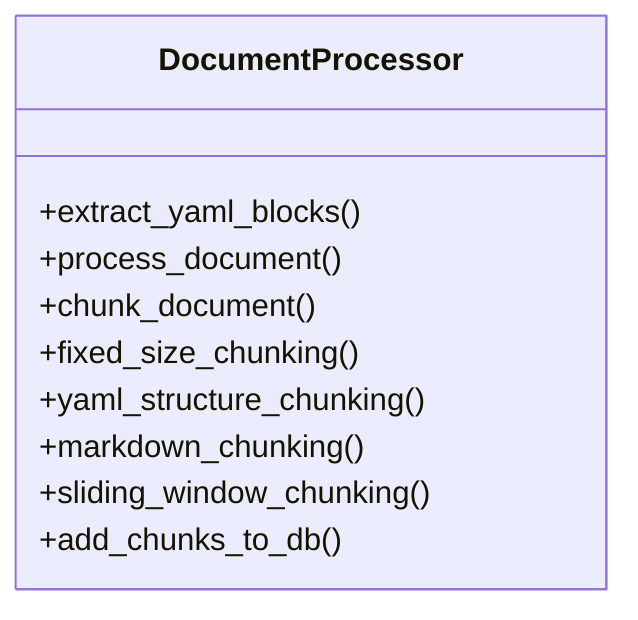

# document_processor

## Module Documentation

::: app.db.document_processor
    options:
        show_source: true
        heading_level: 3
        members_order: source

## Source File

`app\db\document_processor.py`

## Class Diagram

