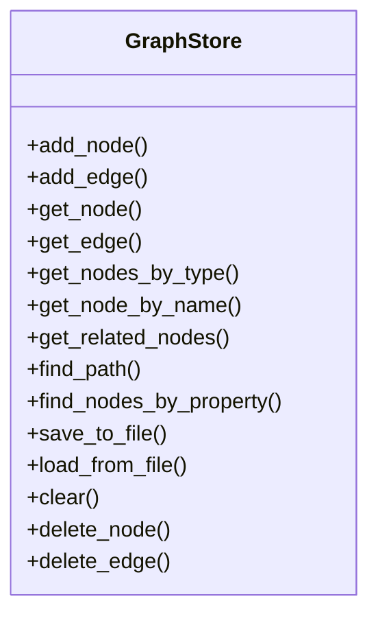

# graph_store

## Module Documentation

::: app.db.graph_store
    options:
        show_source: true
        heading_level: 3
        members_order: source

## Source File

`app\db\graph_store.py`

## Class Diagram

