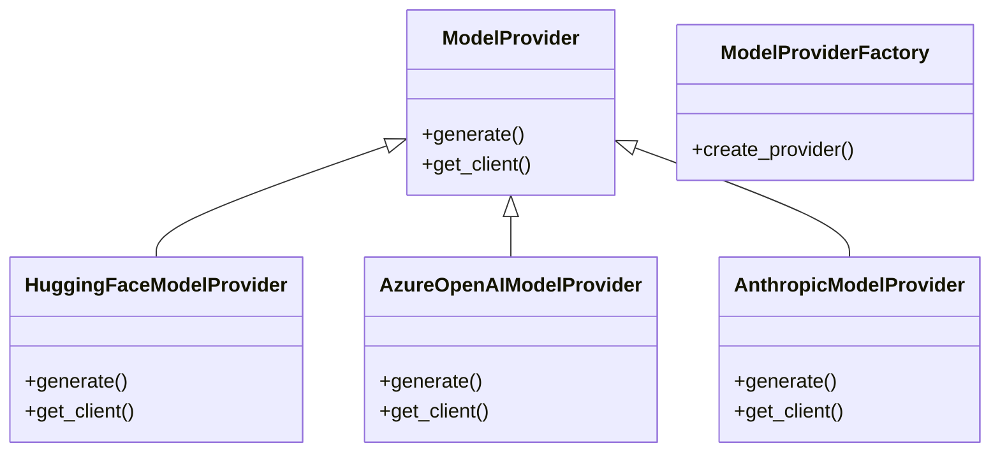

# model_provider

## Module Documentation

::: app.llm.model_provider
    options:
        show_source: true
        heading_level: 3
        members_order: source

## Source File

`app\llm\model_provider.py`

## Class Diagram

