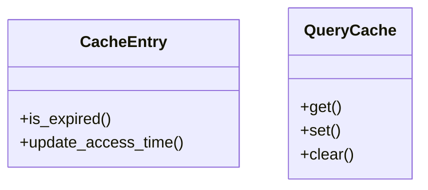

# cache

## Module Documentation

::: app.memory.cache
    options:
        show_source: true
        heading_level: 3
        members_order: source

## Source File

`app\memory\cache.py`

## Class Diagram

