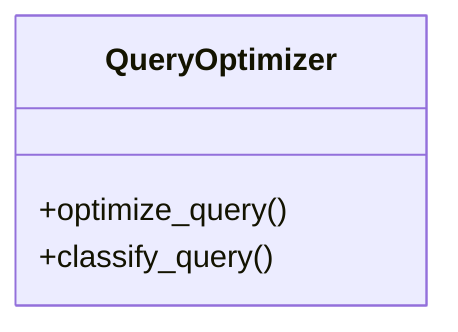

# optimizer

## Module Documentation

::: app.memory.optimizer
    options:
        show_source: true
        heading_level: 3
        members_order: source

## Source File

`app\memory\optimizer.py`

## Class Diagram

