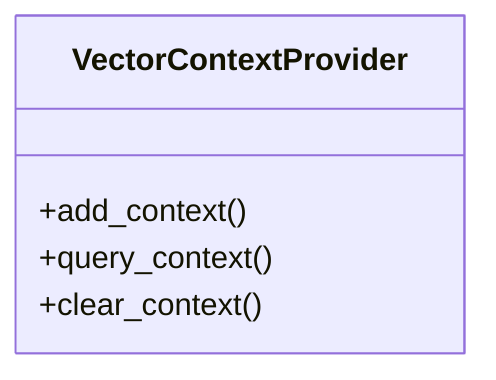

# vector_context_provider

## Module Documentation

::: app.memory.vector_context_provider
    options:
        show_source: true
        heading_level: 3
        members_order: source

## Source File

`app\memory\vector_context_provider.py`

## Class Diagram

