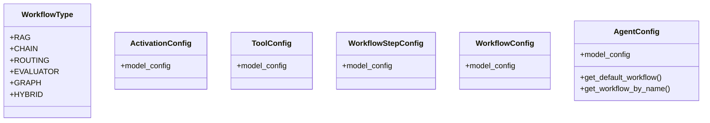

# agent_config

## Module Documentation

::: app.models.agent_config
    options:
        show_source: true
        heading_level: 3
        members_order: source

## Source File

`app\models\agent_config.py`

## Class Diagram

