# types

## Module Documentation

::: app.schema.types
    options:
        show_source: true
        heading_level: 3
        members_order: source

## Source File

`app\schema\types.py`

## Class Diagram

```mermaid
classDiagram
    class EntityType
    EntityType : +DEITY
    EntityType : +RACE
    EntityType : +LOCATION
    EntityType : +EVENT
    EntityType : +ERA
    EntityType : +ARTIFACT
    EntityType : +CONCEPT
    EntityType : +PLANE
    EntityType : +NPC
    EntityType : +FACTION
    EntityType : +VILLAIN
    EntityType : +MONSTER
    EntityType : +PARTY_MEMBER
    EntityType : +QUEST
    EntityType : +SHOP
    EntityType : +TREASURE
    EntityType : +SESSION
    class RelationshipType
    RelationshipType : +CREATED
    RelationshipType : +DESTROYED
    RelationshipType : +RULES
    RelationshipType : +CAUSED
    RelationshipType : +LOCATED_IN
    RelationshipType : +MEMBER_OF
    RelationshipType : +TRANSFORMED_INTO
    RelationshipType : +PARENT_OF
    RelationshipType : +OCCURRED_DURING
    RelationshipType : +CONNECTED_TO
    RelationshipType : +ALLY_OF
    RelationshipType : +ENEMY_OF
    RelationshipType : +ACQUAINTED_WITH
    RelationshipType : +FAMILY_OF
    RelationshipType : +SERVES
    RelationshipType : +LEADS
    RelationshipType : +PROTECTS
    RelationshipType : +THREATENS
    RelationshipType : +HIRED
    RelationshipType : +RESCUED
    RelationshipType : +DEFEATED
    RelationshipType : +COMPLETED
    RelationshipType : +KNOWS_SECRET_ABOUT
    RelationshipType : +OWES_FAVOR_TO
    RelationshipType : +DISTRUSTS
    RelationshipType : +SELLS_TO
    RelationshipType : +TEACHES
    class BaseEntityProperties
    class DeityProperties
    class RaceProperties
    class LocationProperties
    class EventProperties
    class EraProperties
    class ArtifactProperties
    class ConceptProperties
    class PlaneProperties
    class NPCProperties
    class FactionProperties
    class VillainProperties
    class MonsterProperties
    class PartyMemberProperties
    class QuestProperties
    class ShopProperties
    class TreasureProperties
    class SessionProperties
    class BaseRelationshipProperties
    class CreatedProperties
    class DestroyedProperties
    class RulesProperties
    class CausedProperties
    class LocatedInProperties
    class MemberOfProperties
    class TransformedIntoProperties
    class ParentOfProperties
    class OccurredDuringProperties
    class ConnectedToProperties
    class AllyOfProperties
    class EnemyOfProperties
```

