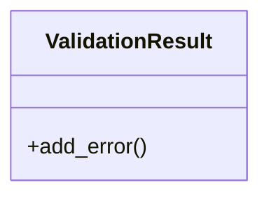

# validation

## Module Documentation

::: app.schema.validation
    options:
        show_source: true
        heading_level: 3
        members_order: source

## Source File

`app\schema\validation.py`

## Class Diagram

