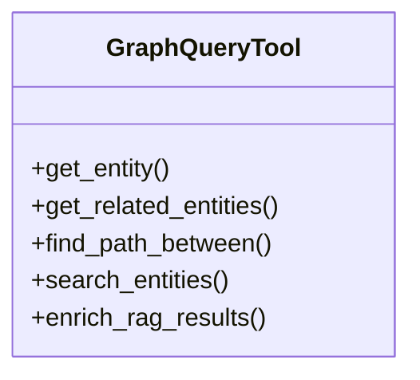

# graph_query_tool

## Module Documentation

::: app.tools.graph_query_tool
    options:
        show_source: true
        heading_level: 3
        members_order: source

## Source File

`app\tools\graph_query_tool.py`

## Class Diagram

