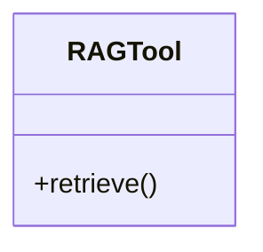

# rag_tools

## Module Documentation

::: app.tools.rag_tools
    options:
        show_source: true
        heading_level: 3
        members_order: source

## Source File

`app\tools\rag_tools.py`

## Class Diagram

