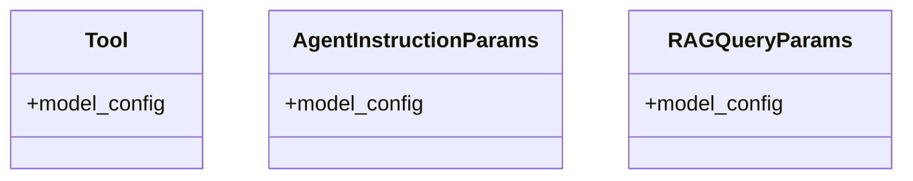

# prompt_generator

## Module Documentation

::: app.utils.prompt_generator
    options:
        show_source: true
        heading_level: 3
        members_order: source

## Source File

`app\utils\prompt_generator.py`

## Class Diagram

