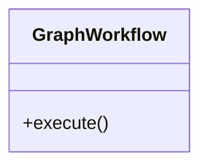

# graph_workflow

## Module Documentation

::: app.workflows.graph_workflow
    options:
        show_source: true
        heading_level: 3
        members_order: source

## Source File

`app\workflows\graph_workflow.py`

## Class Diagram

