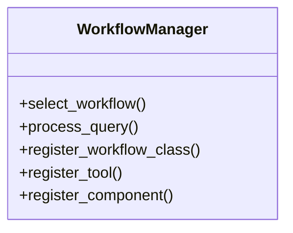

# workflow_manager

## Module Documentation

::: app.workflows.workflow_manager
    options:
        show_source: true
        heading_level: 3
        members_order: source

## Source File

`app\workflows\workflow_manager.py`

## Class Diagram

