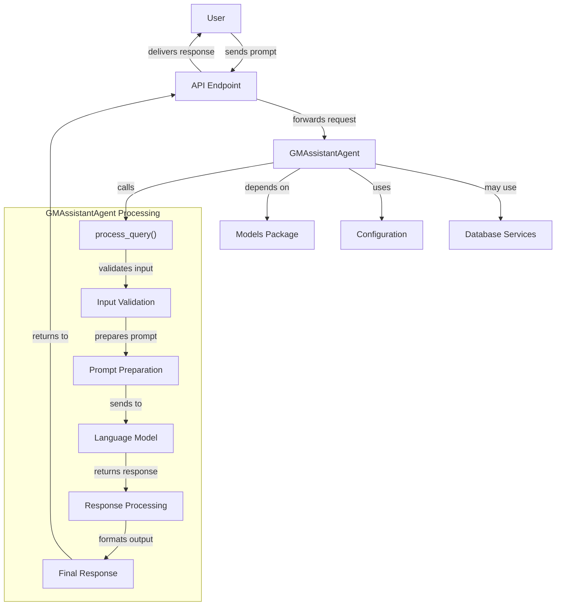
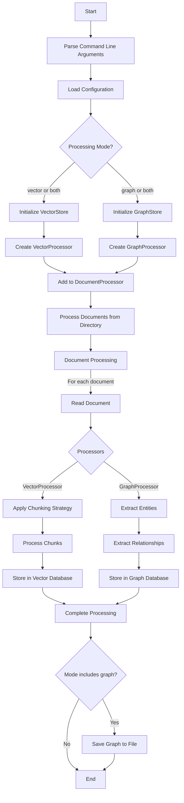

# Project Overview

## API Agent Process

```mermaid
flowchart TD
    User[User] -->|sends prompt| API[API Endpoint]
    API -->|forwards request| GMAssistant[GMAssistantAgent]
    
    GMAssistant -->|calls| ProcessQuery["process_query()"]
    
    subgraph "GMAssistantAgent Processing"
        ProcessQuery -->|validates input| Validation[Input Validation]
        Validation -->|prepares prompt| PromptPrep[Prompt Preparation]
        PromptPrep -->|sends to| LLM[Language Model]
        LLM -->|returns response| ResponseProcess[Response Processing]
        ResponseProcess -->|formats output| FinalResponse[Final Response]
    end
    
    GMAssistant -->|depends on| Models[Models Package]
    GMAssistant -->|uses| Config[Configuration]
    GMAssistant -->|may use| Database[Database Services]
    
    FinalResponse -->|returns to| API
    API -->|delivers response| User
    
    class GMAssistant,ProcessQuery highlight
```

## Document Ingestion Process

```mermaid
flowchart TD
    A[Start] --> B[Parse Command Line Arguments]
    B --> C[Load Configuration]
    C --> D{Processing Mode?}
    
    D -->|vector or both| E[Initialize VectorStore]
    D -->|graph or both| F[Initialize GraphStore]
    
    E --> G[Create VectorProcessor]
    F --> H[Create GraphProcessor]
    
    G --> I[Add to DocumentProcessor]
    H --> I
    
    I --> J[Process Documents from Directory]
    
    J --> K[Document Processing]
    K -->|For each document| L[Read Document]
    L --> M{Processors}
    
    M -->|VectorProcessor| N[Apply Chunking Strategy]
    N --> O[Process Chunks]
    O --> P[Store in Vector Database]
    
    M -->|GraphProcessor| Q[Extract Entities]
    Q --> R[Extract Relationships]
    R --> S[Store in Graph Database]
    
    P --> T[Complete Processing]
    S --> T
    
    T --> U{Mode includes graph?}
    U -->|Yes| V[Save Graph to File]
    U -->|No| W[End]
    V --> W
```
